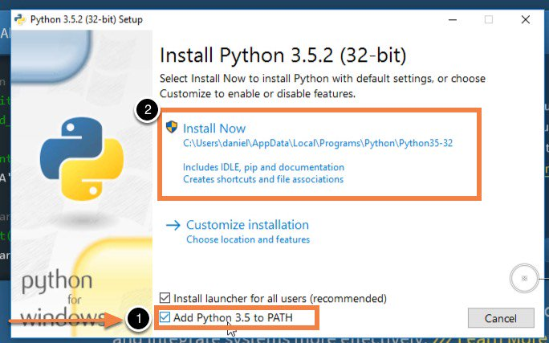

# [GammaVision](https://www.ortec-online.com/products/application-software/gammavision) output parser

This script parses output `.txt` files from GammaVision spectroscopy software, It does convert those files to a long format much more treatable from statistic point of view.

The more appropriate way to treat this output files should be using `R`, however this script does clean that info and rearrange the values in a long format. Then you are gonna be able to treat those values with any kind of statistical software.


## Usage
A general usage would be

```
$ ./gvtxto-parser.py [-i/--input <filename.txt>] [-o/--output <filename.DAT>] [-ot/--out-type {enhanced|raw|csv}]
```

In the case you don't provide any option, you will be prompted about input and output files (tab-autocomplete has not been implemented in this prompting mode, so **I recommend in-line mode to take advantage of shell native autocomplete**) and `--out-type` is set as `raw` by default.

  - `enhanced`

    It will parse also GammaVision `.txt` header. Which consist in info about date, time and a description previously provided by user in GammaVision.
  - **`raw`**

    **It will parse the GammaVision output `.txt` to generate a file with channels raw data**

  - `csv`

    This will produce a `.csv` file (comma separated values), this is the most appropriate format to treat with `R` or any spreadsheet. **You must use `.csv` extension to output file name in this case.**


## Dependencies
Further than `python`, you will need to install a few extra modules available through `pip`:

- `click` to handle/parse command line arguments.
- `regex` to parse data using regular expresions.

You will be able to install these packages performing the following commands, depending on your OS.

### Windows

- ##### Download `python` from their [official website](https://www.python.org/downloads/)

- ##### Install `python`

  - Launch python install process (double click in `python-<whatever>.exe`). you will be asked about some admin password if you choose `install launcher for all users (recommended)`, which is marked by default, and I also recommend to keep that tick enabled.

    - I of course also recommend choose the option `Add python <whatever> to PATH`, like this picture shows

      

      This will allow you to run the script directly from command line using

      `.\gvtxto-parser.py [option1] [option2] ...`

      And you will not need explicitly call installed `python` binary (during previous install process) before type `gvtxto-parser.py` command.

      ==============

      In other way (**if you have not** added python to PATH environment variable) you should run something like:

      ```
      C:\Users\<whatever>\AppData\Local\programs\Python\Python<whatever> .\gvtxto-parser.py [option1] [option2] ...
      ```


- ##### Upgrade `pip`, install `click` and `regex`

  - **This script does not require admin privileges, it is fully functional at user space.** As much, you will be asked for some admin password when performing main `python` install process, but this is normal, of course; it is related to any kind of software install process in the system. **So, open a new `cmd` window and type the following commands:**

    - Upgrade `pip`
    ```
    python -m pip install --upgrade pip
    ```
    - Install `click` and `regex`
    ```
    python -m pip install --user click
    ```
    ```
    python -m pip install --user regex
    ```

You also may want to [add `python` to your PATH environment variable,](https://www.pythoncentral.io/add-python-to-path-python-is-not-recognized-as-an-internal-or-external-command/) **if you did not when you did start python install process.**

==============

**(Optional)** To perform a **system-wide install** you must launch your `python-<whatever>.exe` installer as admin, and perform the `pip` upgrade, `click` and `regex` install process in a **`cmd` window with elevated privileges.**

### Linux
- ##### Install `python`
  I recommend to use the package present at your distro repos. You will need to perform this operation as root.
- ##### Upgrade `pip`
  First update your `pip` module. This may require root privileges.
  ```
  $ sudo python -m pip install --upgrade pip
  ```

- ##### Install `click` and `regex`
  - **(Min. required)** user-side
  ```
  $ python -m pip install --user click
  ```
  ```
  $ python -m pip install --user regex
  ```

  ==============
  - **(Optional)** system-wide / install as root
  ```
  $ sudo python -m pip install click
  ```
  ```
  $ sudo python -m pip install regex
  ```


## License

This project is licensed under **GPLv3.** - see the [LICENSE.md](LICENSE.md) file for details.
